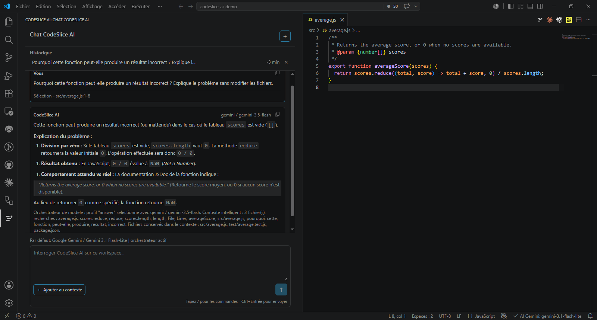

# CodeSlice AI

[English](#english) · [Français](#français)

## English

Project-aware AI coding assistant for Visual Studio Code.

CodeSlice AI supports multiple AI providers using your own API keys, controlled multi-file edits with diff previews, project-aware chat, conversation history, commit message generation, and Codestral autocomplete.

[Install CodeSlice AI from the Visual Studio Marketplace](https://marketplace.visualstudio.com/items?itemName=masskrdjn.codeslice-ai)

### Support

Use [GitHub Issues](https://github.com/masskrdjn/codeslice-ai-support/issues) to report bugs or suggest improvements.

Please do not include API keys, personal data, private source code, or other sensitive information in an issue.

### Privacy

CodeSlice AI collects no telemetry and sends no data to its developer. Instructions and project context are sent directly to the selected AI provider only when you make a request.

## Français

Assistant de code IA pour Visual Studio Code, utilisant le contexte réel de votre projet.

CodeSlice AI prend en charge plusieurs fournisseurs d’IA avec vos propres clés API, les modifications multi-fichiers contrôlées avec aperçu des différences, le chat avec contexte projet, l’historique des conversations, la génération de messages de commit et l’autocomplétion Codestral.

[Installer CodeSlice AI depuis le Marketplace Visual Studio](https://marketplace.visualstudio.com/items?itemName=masskrdjn.codeslice-ai)

### Assistance

Utilisez les [Issues GitHub](https://github.com/masskrdjn/codeslice-ai-support/issues) pour signaler un bug ou proposer une amélioration.

N’y publiez aucune clé API, donnée personnelle, partie de code privé ou autre information sensible.

### Confidentialité

CodeSlice AI ne collecte aucune télémétrie et ne transmet aucune donnée à son développeur. Les instructions et le contexte du projet sont envoyés directement au fournisseur IA sélectionné, uniquement lorsque vous effectuez une requête.

## Screenshot / Capture d’écran

## About this repository / À propos de ce dépôt

This public repository contains support information and screenshots only. The extension source code is maintained in a private repository.

Ce dépôt public contient uniquement les informations d’assistance et les captures d’écran. Le code source de l’extension est conservé dans un dépôt privé.
